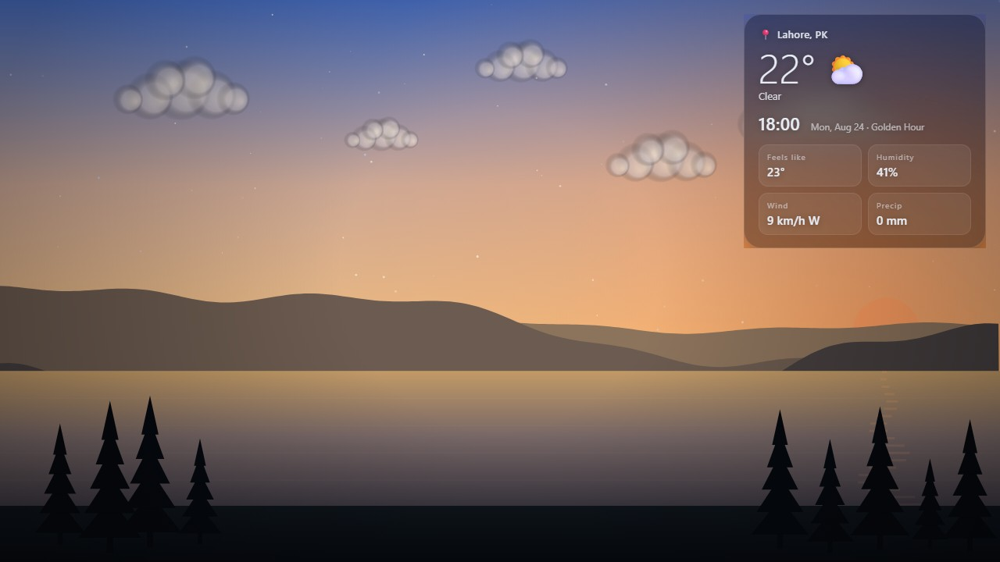
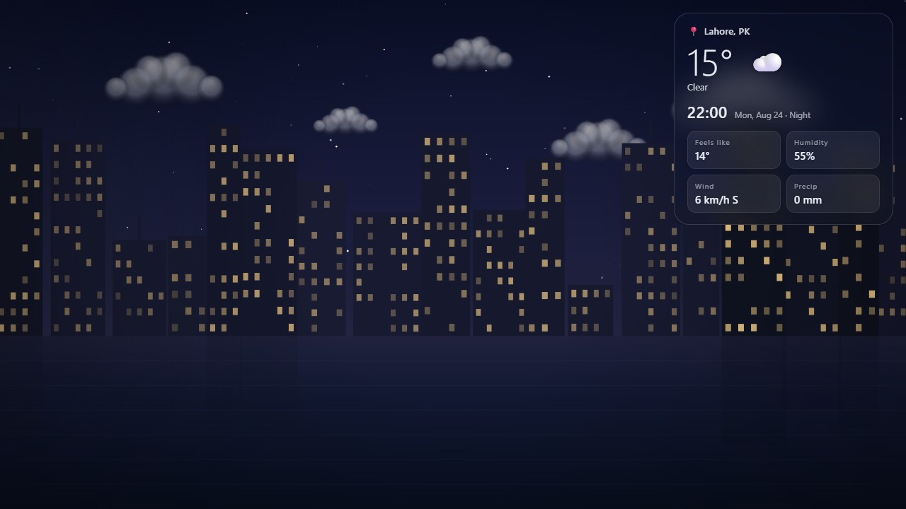
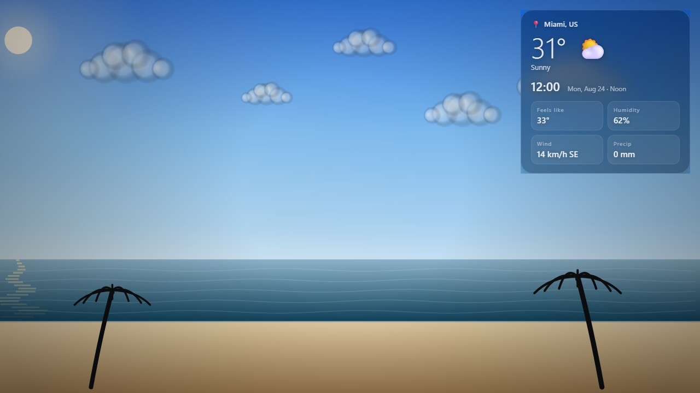
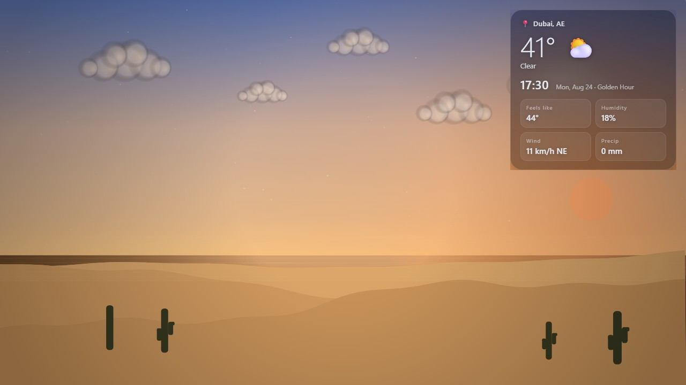
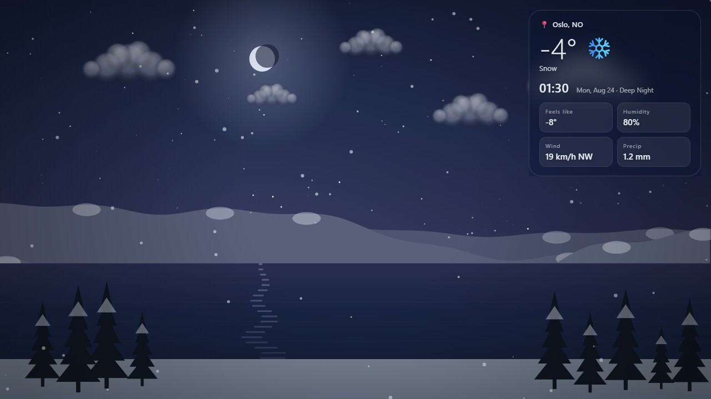

# Living Wallpaper (Windows)

[](https://github.com/adnaanaeem/living-wallpaper/releases/latest)
[](https://adnaanaeem.github.io/living-wallpaper/)
[](https://github.com/adnaanaeem/living-wallpaper/actions)
[](LICENSE)

> **Developers:** read **`CLAUDE-HANDOFF.md`** first — it documents the architecture,
> the `tools/` pipeline, the config schema, and the roadmap.


A live desktop wallpaper: one scene that moves through **sunrise → noon → sunset → night**
in real time, with **live rain/snow**, **temperature-driven visuals** (snow caps, frost,
heat-haze), an on-screen **weather panel** (auto location by IP, powered by Open-Meteo),
and an option to **relight your own photo** through the day.

**[Try the live demo →](https://adnaanaeem.github.io/living-wallpaper/)** — scrub the full
24-hour cycle with a seek bar, switch scenes, and test rain/snow at any temperature,
right in your browser. No install needed.



## Screenshots

| | |
|---|---|
|  |  |
| **City** — windows light up after dark | **Beach** — bright noon, waves & palms |
|  |  |
| **Desert** — heat-haze on the horizon | **Mountains** — snow at night, moonlit |

There are two ways to run it — pick either or both.

---

## Option A — Lively Wallpaper pack (works in minutes) ✅

The fastest way to see it live on your desktop. No build step.

1. Install **Lively Wallpaper** (free) from the Microsoft Store or https://www.rocksdanister.com/lively/

2. Import it — use **one** of these (this is the step that usually trips people up):

   - **Easiest:** drag **`LivingWallpaper-Lively.zip`** — included next to this project,
     or download the latest one from [Releases](https://github.com/adnaanaeem/living-wallpaper/releases/latest) —
     and **drop it onto the Lively window**. Lively reads the manifest from the zip root.
   - **Or:** in Lively click **+ Add Wallpaper**, then in the box that says
     *“Drag & drop or paste a file/URL”*, browse to and select the **`index.html`**
     file inside the `lively/` folder — **not** the folder itself.

   > Dragging the *folder* onto Lively often does nothing (that's the “nothing happens”
   > you saw). Use the **zip** or select **index.html** directly.

3. It appears in your library with an animated sunset preview — click it to apply.
4. Right-click the wallpaper → **Customize** to toggle the weather panel, switch
   **°C/°F**, choose **12-hour / 24-hour clock**, or set a city label.

**Use your own photo (in Lively):** in Customize, tick **“Use photo background”**, then in
the **“Photo background”** dropdown click the small **folder / ＋ (add file)** button and
choose your image. Lively copies it into the wallpaper and it displays immediately.
(You can't just paste a `C:\...` path — Chromium blocks a wallpaper page from reading
arbitrary local files, which is why a pasted path shows nothing. The add-file button
avoids that by copying the image in.) Untick the box to return to the illustrated scene.

Location & weather are detected automatically (via IP). Lively pauses the wallpaper
on fullscreen apps/games for you.

### Show it on ALL monitors (extended displays)
Lively applies a wallpaper to **one screen by default** — that's why it only showed on
the laptop. To cover the extended monitor too, in the **Lively app**:

1. Open Lively's main window. Near the top there's a **monitor / display selector**
   (a small screens icon, or **Settings → Wallpaper → “Select display”**).
2. Set the arrangement to **“Same wallpaper for all screens”** (a.k.a. *Duplicate /
   Span*). In some Lively versions you instead **click each monitor** in the selector
   and apply this wallpaper to it individually.
3. If a monitor still shows the old background, select that monitor and click the
   Living Wallpaper tile again.

> This is a Lively setting, not something the wallpaper file controls — the HTML fills
> whatever screen Lively hands it. (The standalone app in `src/` has its own “All
> monitors / pick a monitor” option in Settings.)

### Troubleshooting “nothing happens”
- Make sure you imported the **zip** or the **index.html file** (see above), not the folder.
- Lively must be **running** and set as your wallpaper engine.
- First render needs a second or two; the scene draws even offline (weather just won't
  populate without a connection).
- If the tile is added but blank, right-click it → **Customize** and confirm; or remove
  and re-import via the zip.

---

## Option B — Standalone app (real .exe, no extra software)

A self-contained Electron app that renders **behind your desktop icons** using the
Windows Progman/WorkerW technique (via `electron-as-wallpaper`), with a **system-tray
menu**, a **settings window**, **autostart**, **multi-monitor** targeting, and
**game-pause**.

### Prerequisites
- **Windows 10/11 (x64)**
- **Node.js 18+** (https://nodejs.org)

### Run from source
```bash
cd LivingWallpaper
npm install
npm start
```
The wallpaper appears behind your icons and a tray icon shows up. Double-click the
tray icon (or right-click → Settings…) to configure.

### Build an installer (.exe)
```bash
npm run dist
```
Output lands in `dist/` (an NSIS installer). For a quick unpacked build use `npm run pack`.

### Tray menu
- **Settings…** — photo(s), units, location (type a city **or click a map**), monitor,
  panel, autostart
- **Preview…** — scrub the full 24-hour cycle with a seek bar, test temperature/rain/
  snow, and switch scenes instantly, without waiting for real time to pass
- **Pause / Resume** — stop rendering to save power
- **Reload wallpaper** — re-attach after display changes
- **Start with Windows** — toggle autostart
- **Check for Updates…** — manually check GitHub Releases for a newer version
- **About…** — version, description, and developer info (pulled from GitHub)
- **Quit**

### Auto-update
The installed app checks GitHub Releases for a newer version on launch and every 6
hours. If one's found, it asks before downloading, then asks again before restarting to
install — nothing happens without confirmation. Only applies to the installed `.exe`,
not `npm start`.

---

## Build in the cloud (no local build needed)
See **SETUP-GITHUB.md** — push to GitHub and the included Actions workflow builds the
`.exe` on a Windows runner and attaches it to the run / a Release.

## Illustrated scenes
Four built-in scenes, each with the full day-cycle, weather and temperature effects:
**Mountains & Lake**, **City Skyline** (windows light up at night), **Ocean / Beach**
(waves + palms), and **Desert Dunes** (cacti, strong heat-haze). Plus **Rotate daily**
and **Random each launch**. Choose it in **Settings → Background → Illustrated scene**
(standalone) or **Customize → Illustrated scene** (Lively). Scenes show when no photo is set.

## Photo modes
- **Single photo:** relight one image through the day (global day/night color grade + sun bloom).
- **Day cross-fade (most realistic):** pick several photos of the *same view* at different
  times (dawn/noon/dusk/night). They're spaced evenly across 24h and blended as the clock
  moves, so real shadows and light actually change. Set both in **Settings → Background**.

## Assets (already generated)
- `assets/icon.ico`, `assets/icon-256.png`, `assets/tray.png` — app/tray icons.
- `lively/thumbnail.jpg`, `lively/preview.jpg` — Lively library art.
Replace them with your own art any time.

## Configuration & data
- Settings are stored at `%APPDATA%/Living Wallpaper/config.json`.
- Weather: [Open-Meteo](https://open-meteo.com) (no API key). Location: `ipwho.is`
  (no key) or a city you set in Settings.

## Project layout
```
LivingWallpaper/
├─ package.json
├─ README.md
├─ src/
│  ├─ main.js          Electron main: wallpaper windows, WorkerW attach, tray, IPC
│  ├─ preload.js       Safe IPC bridge for the settings window
│  ├─ config.js        JSON config load/save (userData)
│  ├─ desktop-win.js   Optional koffi FFI: fullscreen detection for game-pause
│  ├─ wallpaper.html   The live scene (production build of the renderer)
│  └─ settings.html    Settings UI
├─ lively/
│  ├─ index.html       Same renderer, packaged for Lively
│  ├─ LivelyInfo.json
│  └─ LivelyProperties.json
└─ assets/             (add icon.ico + tray.png)
```

## Notes / known limits
- **Standalone attach:** `electron-as-wallpaper` implements the WorkerW reparenting.
  If a Windows update changes shell behaviour and the window ever sits *in front of*
  icons, use the Lively pack (Option A) which is independently maintained. Both use the
  identical scene.
- **Game-pause** in the standalone build relies on `koffi` (prebuilt, no compiler). If
  it can't load, auto-pause is skipped but manual Pause and Lively's own pause still work.
- **Photo relighting** is a global day/night color grade; it can't move real shadows.
  For maximum realism, shoot the same scene at a few times of day and cross-fade — ask
  and this can be added as a "multi-photo" mode.
- Rendering `.exe` requires building on Windows (or a Windows CI runner) — but you don't
  have to: every [Release](https://github.com/adnaanaeem/living-wallpaper/releases/latest)
  ships a prebuilt installer **and** a matching `LivingWallpaper-Lively.zip`, built
  together from the same commit so they never drift apart.
